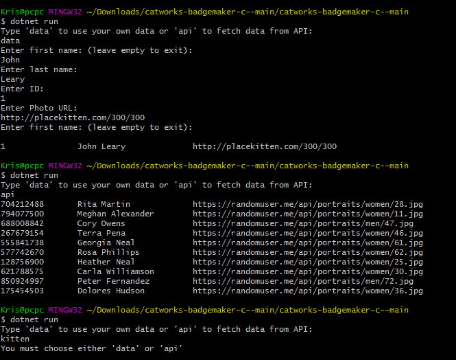
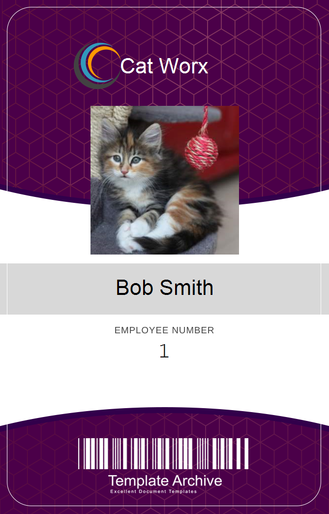
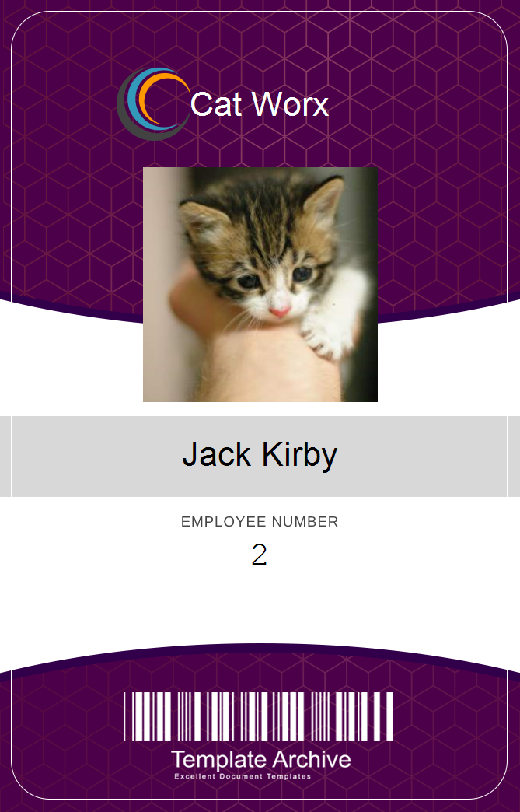
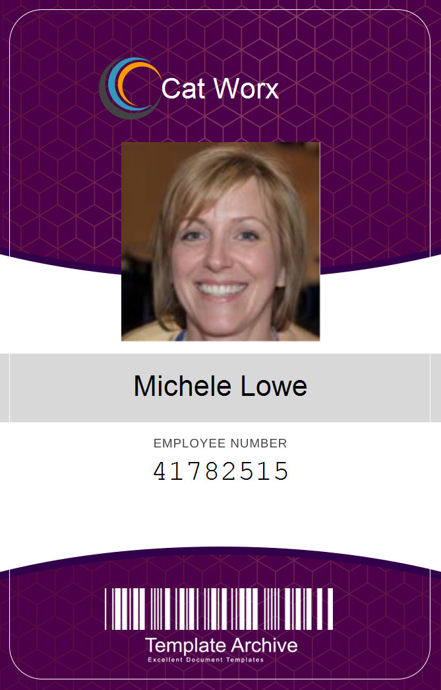
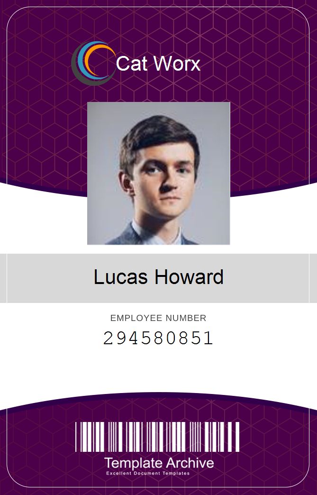

# CatWorx Badgemaker C#

## Description

In this project I have created a CLI application to generate employee badges either by using input from the user or by fetching data from an API. I have used the System.IO namespace to write to a CSV file, System.Drawing.Common package to use graphics tools and WebClient to insert employee data into the badge template.

## What I have done

- [x] Set up C# development environment and created a new CLI application
- [x] Used namespaces to organize the code and import libraries from the .NET framework.
- [x] Defined functions and classes by using C# syntax.
- [x] Used the System.IO namespace to write to a CSV file.
- [x] Imported the System.Drawing.Common package to use graphics tools to create the badge template background.
- [x] Used the WebClient class to insert employee data into the badge template.

## Contributing

Submit a pull request

## Link to GitHub repository

https://github.com/ivnkris/catworks-badgemaker-c-

## Screenshots

## Questions

- Send any questions via my [GitHub profile](https://github.com/ivnkris)
